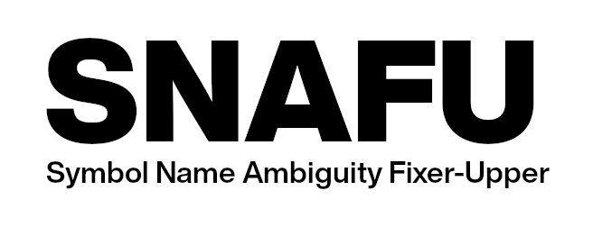
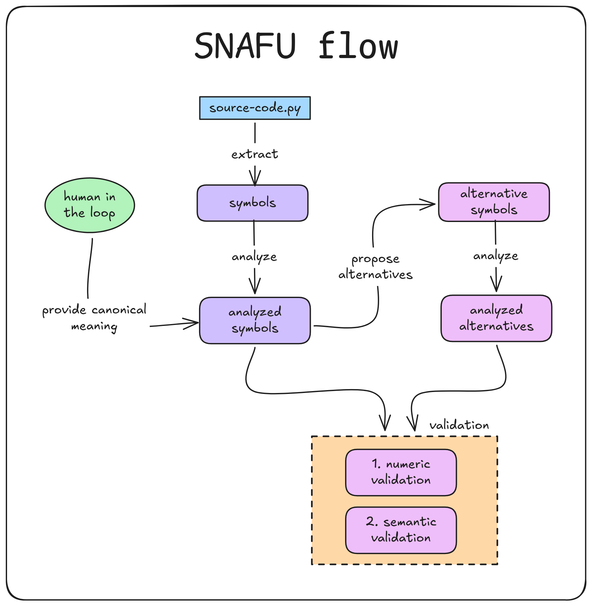

# SNAFU: Symbol Name Ambiguity Fixer-Upper

<p align="center">
  
</p>

> Is "naming things" hard? And if so, can one detect and measure name quality?
> Rhetorical question. The answer is yes.

`snafu` is an agentic LLM flow to help you with "naming things" in source
code.

`snafu` computes the **Name Ambiguity Number (NAN)** for symbols in your
codebase, a quantifiable score for how ambiguous the name is. Then it walks
you through an _agentic pipeline™_ to replace it with a clearer name.

## How it works



`snafu` first obtains symbols in your source file, and sends them
along the `snafu` pipeline with **no extra context** (no function body, no
docstring, no surrounding code).

Our heuristic is: reducing the ambiguity of a symbol with no extra context
will also reduce it even when the symbol is back in its original context. By
stripping the context away, we simulate the cognitive load of a developer
reading a function with fresh eyes.

Note: Currently *not all symbols are extracted*. We currently try to find the
most relevant symbols (by kind and hierarchy), while avoiding symbols which
are often superfluous, like inline variables.

### 1. Estimate how ambiguous a name is.

Every symbol in the file is sent to an LLM with _no other context_ and one
question: _given only this name, what are the plausible, mutually-exclusive
things it could mean, and how likely is each one?_

The model returns a short list of interpretations with probabilities that
sum to 1. For a symbol like `process_request`, that might look like:

```txt
0.55  handle an incoming request end-to-end (parse, validate, respond)
0.30  transform/normalize a request object before use elsewhere
0.15  log or record that a request occurred
```

Naturally, the LLM can generate interpretations and probabilities which are
not correct. Yet, we believe that an LLM is a good-enough measure of semantic
ambiguity for our needs.

That distribution is the raw material to generate the **Name Ambiguity Number
(NAN)**. Here's how it's built:

#### Math detour

If an interpretation has probability `p`, we obtain the **Shannon Entropy** of
the symbol like this:

```txt
shannon_entropy(symbol) = - sum(p[i] * log2(p[i]))
```

This is basically "the weighted average of the number of steps one should take
on a binary decision tree which identifies an outcome (the 'outcome' being the
result of 'picking an interpretation')"

Yes, it's tricky. It's a bit of statistics and a bit of computer science. In
simpler terms:

- If the number is `0`, there is only one possible interpretation (this is the
  ideal)
- The higher the number, the more variance of reasonable interpretations that
  someone reading the symbol might choose.

NAN is actually a modification, to make it easier to reason about:

```txt
NAN(s) = 2 ** shannon_entropy(s)   # aka "perplexity"
```

Now, if a symbol had `k` _equally likely_ interpretations, `NAN = k`.

A small example:

| interpretation split | NAN  |
| -------------------- | ---- |
| 50 / 50              | 2.00 |
| 90 / 10              | 1.38 |
| 99 / 1               | 1.06 |

All three rows have "2 interpretations," but NAN correctly reports that a 99/1
split is barely ambiguous (`NAN = 1` is the ideal).

### 2. User is prompted to confirm the real meaning

`snafu` shows you each symbol's interpretations (and their probabilities) and
asks which one is actually correct, or type your own description if none of
them fit. 

This **human-in-the-loop** step provides the ground truth the rest of the
pipeline builds on.

### 3. The LLM suggests a better name

For every symbol you confirmed, the LLM is given the original name and your
confirmed meaning, and asked to propose a new name that expresses _only_ that
meaning, better than the previous name.

### 4. Checking the rename actually helped

The proposed name goes through the exact same first step: getting fresh
interpretations, and calculating a new NAN. This produces a **NAN delta**:

```txt
delta = NAN(original) - NAN(proposed)
```

A positive delta means the new name is less ambiguous than the old one. Any
candidate that doesn't improve (`delta ≤ 0`) is **dropped** here.

### 5. Sanity-checking the survivors

A model reviews each surviving rename with full context: both names, the
confirmed meaning, and each name's top alternative interpretation. 

It checks two things: does the new name make sense on its own, and is its top
interpretation matching the confirmed meaning. 

This catches renames that scored well numerically but are wrong or misleading.

### 6. Report

Finally, the information for all proposed renames are presented to the user.

## Requirements

- Python >= 3.14
- `uv`

## Install

Install with `uv`, from inside this repo:

```sh
uv tool install .              # installs the `snafu` command on PATH
```

Or straight from the git repository:

```sh
uv tool install git+https://github.com/sebastiancarlos/snafu
```

## Usage

```bash
export OPENAI_API_KEY=sk-...
export OPENAI_BASE_URL=https://my-custom-host/v1 # optional override

snafu path/to/file.py
```

### Choosing a model

`snafu` uses the **`any-llm`** library (a lightweight version of **LiteLLM**)
to support connecting to any LLM provider.

Pass `--model` as `<provider>:<model-name>` to use any supported provider. A
bare name with no prefix (e.g. `gpt-4o-mini`) is treated as OpenAI.

```bash
snafu file.py --model anthropic:claude-haiku-4-5-20251001
snafu file.py --model gemini:gemini-2.5-flash
```

Each provider reads configuration from their own env var (`OPENAI_API_KEY`,
`OPENAI_BASE_URL`, `ANTHROPIC_API_KEY`, ...). For the full list of supported
providers, model names, and env vars, see the [any-llm provider
docs](https://docs.mozilla.ai/any-llm/providers/).

### Language support

By default `snafu` understands Python natively and uses **Tree-sitter** for
symbol extraction in other languages: Ruby, C#, Java, JavaScript, TypeScript,
PHP, Rust, and Go.

Tree-sitter grammars download on first use per language.

### Full `--help` output

``` bash
usage: snafu [-h] [--symbols-file SYMBOLS_FILE] [--dry-run] 
             [--min-words MIN_WORDS] [--model MODEL] [--limit LIMIT] [file]

Compute and improve "Name Ambiguity Numbers (NAN)" for symbols in source code.

positional arguments:
  file                  source file to analyze

options:
  -h, --help            show this help message and exit
  --symbols-file SYMBOLS_FILE
                        read symbols from this file, one per line, instead of
                        extracting them from a source file (used as-is,
                        --min-words not applied)
  --dry-run             only extract and list symbols, then exit (no LLM
                        calls)
  --min-words MIN_WORDS
                        only score symbols with >= N words (default 2)
  --model MODEL         model to use (default gpt-4o-mini)
  --limit LIMIT         cap number of symbols to process

Env vars:
    OPENAI_API_KEY      OpenAI key (required for OpenAI models)
    OPENAI_BASE_URL     optional; base URL, e.g. https://my-host/v1

    Other providers read their own env vars (ANTHROPIC_API_KEY, ...).
    See https://docs.mozilla.ai/any-llm/providers/ for the full list.
```

## License

MIT
